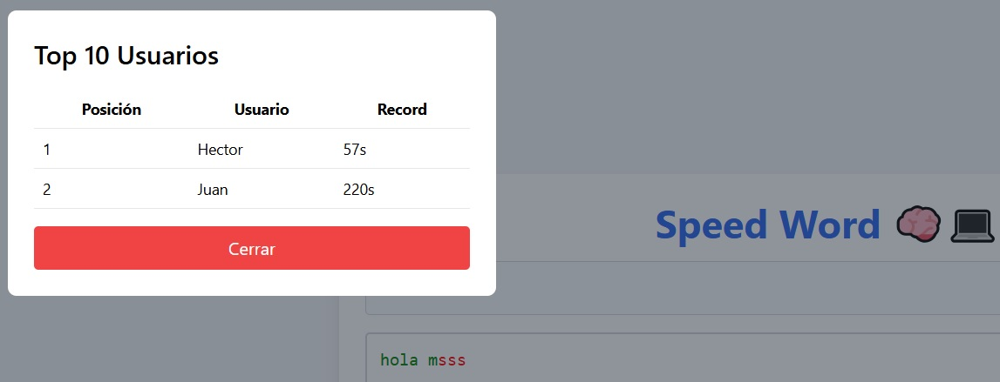

# 🕹️ SpeedWord - Juego de Escritura veloz

SpeedWord es un juego web donde el usuario debe escribir 
correctamente fragmentos de frases.
El sistema colorea en verde el texto correcto y en rojo desde el primer error.
Se mide el tiempo, y si el jugador termina los 5 niveles, se registra su récord.

## 🛠️ Tecnologías utilizadas

- Java 17 + Spring Boot (backend)
- HTML5 +  CSS (frontend)
- JavaScript puro (lógica de escritura)
- MySQL (base de datos para guardar récords)

## ✨ Características

- Juego interactivo con 5 niveles (cada nivel es un fragmento de una frase).
- El texto se colorea en tiempo real (verde o rojo).
- Bloqueo de pegar texto para evitar trampas.
- Al finalizar el juego:
  - Se pide nombre de usuario y contraseña para registrar el récord.
  - Se guarda el mejor tiempo en segundos.
  - Si entras al top 10, se muestra visualmente.
- Se actualiza automáticamente el top 10 si rompes un récord.

## 📸 Capturas de pantalla

  

## 🚀 Ver en línea

🔗 [https://speedword.onrender.com/](https://speedword.onrender.com/) 

## 🖥️ Cómo correrlo localmente

### Requisitos:
- Java 17
- Maven
- MySQL

### Pasos:

1. Clona el repositorio:
git clone https://github.com/kakzumooto/speedword.git
